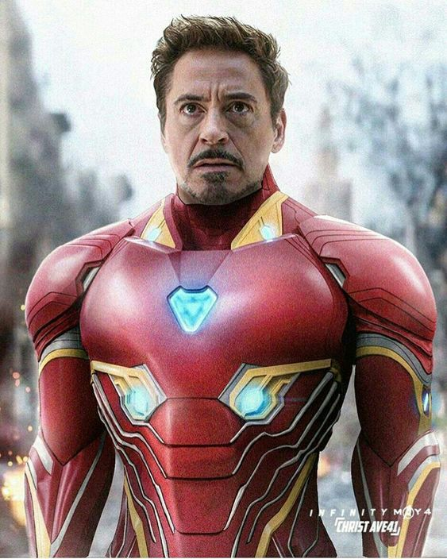
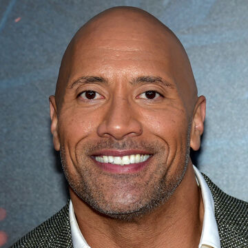
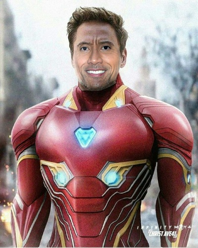
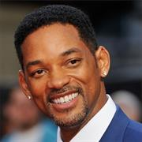
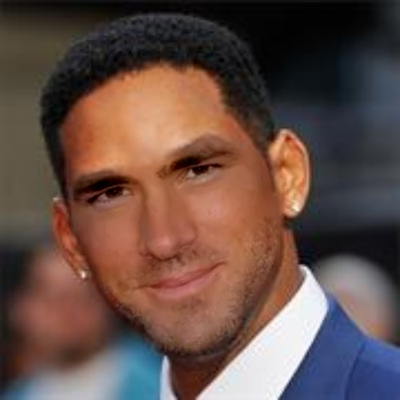
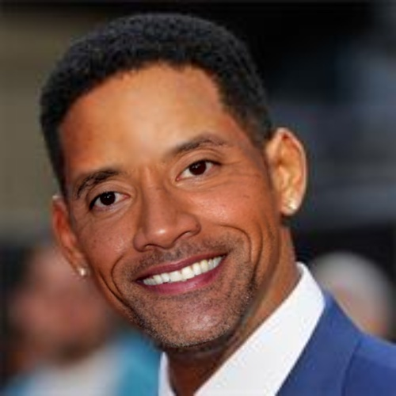
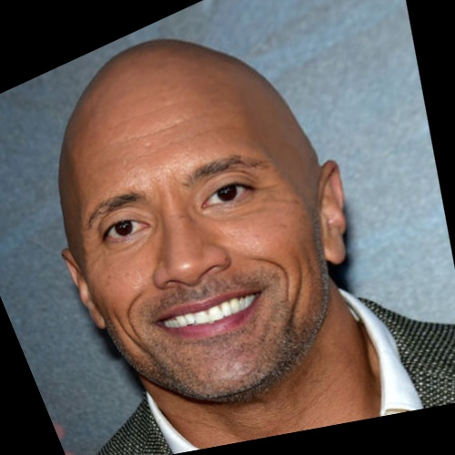
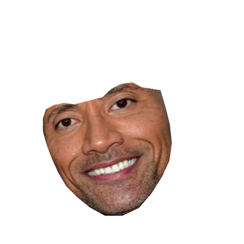
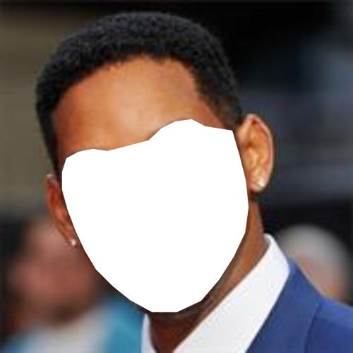
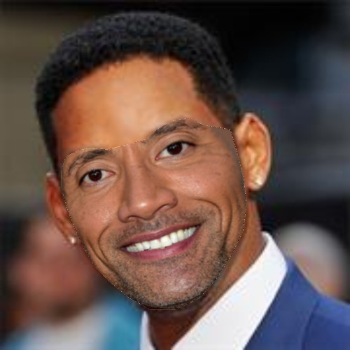

# FaceSwap

## Output Example

| Body | Face | Output |
| --- | --- | --- |
| |  |  |
| |  |  |
| |  |  |

## Dependency 
- [Download]("http://dlib.net/files/shape_predictor_68_face_landmarks.dat.bz2") the dlib shape predictor which [68 landmark points](https://ibug.doc.ic.ac.uk/media/uploads/images/300-w/figure_1_68.jpg) on face
- Requirements: skimage, opencv-python, Pillow, dlib   `pip3 install Pillow opencv-python dlib scikit-image`

## Steps:
- Extract Landmark
- Compute and Apply Projective Transformation of face image
- Crop and Paste face image on the body image
- Apply Blending

	
	 

### Extract Landmark
Extract 68 facial landmark using dlib shape predictor

	
	 

### Compute and Apply Geometric Transformation of face image
By using 68 keypoint calculate the projective transformation and apply it on the face image

### Crop and Paste face image on the body image

#### Crop the image

	
	 

#### Paste face image on the body image

### Apply Blending
To match the body tone with the face we are using `cv2.seamlessClone`

## References:
- [Satya Malik / learnopencv](https://learnopencv.com/face-swap-using-opencv-c-python/)